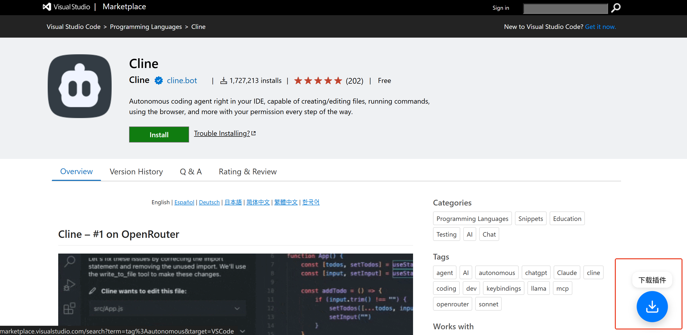
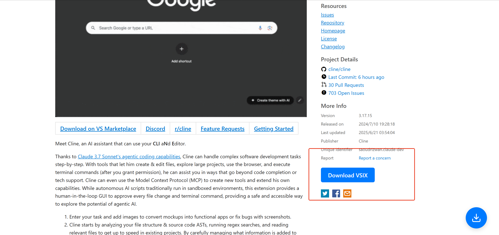

# VSCode Plugin Downloader (Userscript)

[中文版本](README.md)

This is a Tampermonkey userscript that adds a convenient download button to Visual Studio Code Marketplace pages, allowing you to easily download VSIX plugin packages for offline installation.

## Features

- **Easy Download**: Adds two download buttons to the plugin page:
  1. A floating button in the bottom-right corner for quick access.
  2. A static button below the "More Info" section for clear visibility.
- **Auto-generates Links**: Automatically detects the plugin's `publisher`, `extension name`, and `version` to generate the correct `.vsix` download link.
- **User-Friendly UI**: The floating button features a modern, Apple-style design with interactive hover effects and clear tooltips.

## Preview

*Floating download button and hover effect:*

*Static download button below "More Info":*

## Installation

To use this script, you need a user script manager. [Tampermonkey](https://www.tampermonkey.net/) is recommended.

1. **Install a User Script Manager**:

   - [Install Tampermonkey from the Chrome Web Store](https://chrome.google.com/webstore/detail/tampermonkey/dhdgffkkebhmkfjojejmpbldmpobfkfo)
   - [Install Tampermonkey from the Firefox Add-ons Store](https://addons.mozilla.org/en-US/firefox/addon/tampermonkey/)
   - [Install Tampermonkey from the Microsoft Edge Add-ons Store](https://microsoftedge.microsoft.com/addons/detail/tampermonkey/iikmkjmpaadaobahmlepeloendndfphd)
2. **Install this Script**:

   - install the script. copy code in 'vscode-plugins-download.user.js'
   - Your script manager will automatically open and ask for confirmation. Click `Install`.

## How to Use

1. Visit any plugin page on the [VSCode Marketplace](https://marketplace.visualstudio.com/vscode).
   - Example: [Claude.ai for VSCode](https://marketplace.visualstudio.com/items?itemName=saoudrizwan.claude-dev)
2. The script will automatically add the download buttons to the page.
3. Click either the floating or the static button to download the `.vsix` file.

## License

This project is licensed under the MIT License - see the [LICENSE](LICENSE) file for details.
