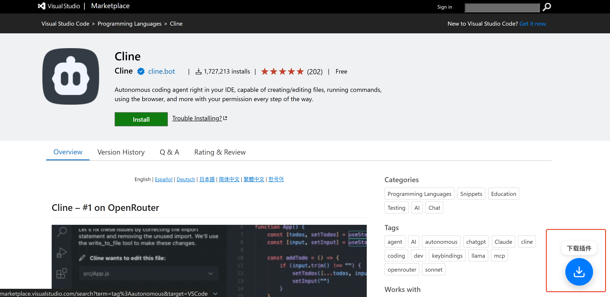

# VSCode 插件下载器 (油猴脚本)

[English Version](README.en.md)

这是一个油猴（Tampermonkey）用户脚本，它在 Visual Studio Code 插件市场页面上添加了一个方便的下载按钮，让您可以轻松下载 VSIX 插件包以进行离线安装。

## 功能特性

- **轻松下载**: 在插件页面上添加两个下载按钮：
  1. 一个位于右下角的悬浮按钮，方便快速访问。
  2. 一个位于“More Info”区域下方的静态按钮，位置清晰明确。
- **自动生成链接**: 自动检测插件的 `发布者`、`扩展名` 和 `版本`，以生成正确的 `.vsix` 下载链接。
- **友好的用户界面**: 悬浮按钮采用现代化的苹果风格设计，具有交互式悬停效果和清晰的文字提示。

## 效果预览

*悬浮下载按钮及悬停效果:*

*“More Info”下方的静态下载按钮:*

## 安装步骤

要使用此脚本，您需要一个用户脚本管理器。推荐使用 [Tampermonkey](https://www.tampermonkey.net/)。

1. **安装用户脚本管理器**:

   - [Chrome 应用商店安装 Tampermonkey](https://chrome.google.com/webstore/detail/tampermonkey/dhdgffkkebhmkfjojejmpbldmpobfkfo)
   - [Firefox 应用商店安装 Tampermonkey](https://addons.mozilla.org/zh-CN/firefox/addon/tampermonkey/)
   - [Edge 应用商店安装 Tampermonkey](https://microsoftedge.microsoft.com/addons/detail/tampermonkey/iikmkjmpaadaobahmlepeloendndfphd)
2. **安装本脚本**:

   - 点击[此处](https://github.com/your-username/your-repo/raw/main/vscode-plugins-download.user.js)安装脚本。 `<!-- 请替换为您的原始脚本链接 -->`
   - 您的脚本管理器将自动打开并请求确认。点击 `安装` 即可。

## 如何使用

1. 访问 [VSCode 插件市场](https://marketplace.visualstudio.com/vscode) 上的任意插件页面。
   - 例如: [Claude.ai for VSCode](https://marketplace.visualstudio.com/items?itemName=saoudrizwan.claude-dev)
2. 该脚本将自动在页面上添加下载按钮。
3. 点击悬浮按钮或静态按钮即可下载 `.vsix` 文件。

## 许可证

本项目基于 MIT 许可证授权 - 详情请参阅 [LICENSE](LICENSE) 文件。
